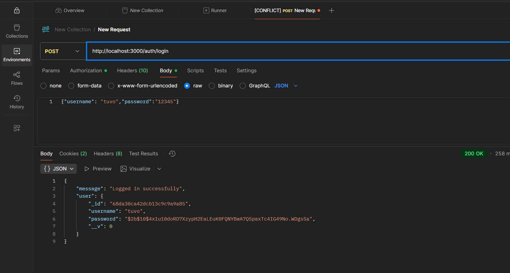

# LOCAL PASSPORT AUTH SERVICE
 Description
Thực hành xác thực người dùng bằng **Passport Local Strategy (API)** trong NodeJS.

---

##  Run project
```bash
npm install
node app.js
```

---

## Test with Postman

### Register
**POST** `http://localhost:3000/register`  
Body:
```json
{ "username": "tuvo", "password": "123456" }
```
📸 

---

### Login
**POST** `http://localhost:3000/login`  
Body:
```json
{ "username": "tuvo", "password": "123456" }
```
📸 

---

## 📘 Author
**22670361 - Võ Thị Cẩm Tú**
